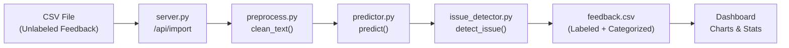
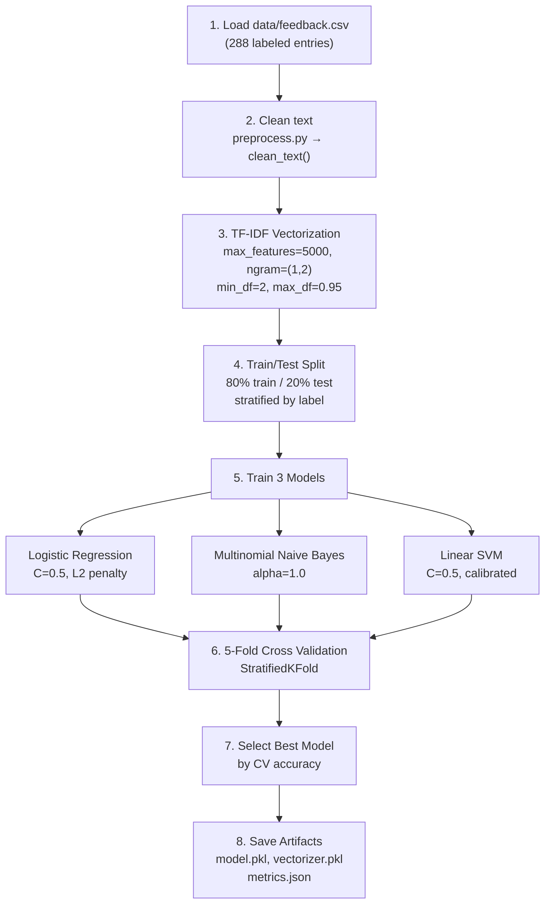
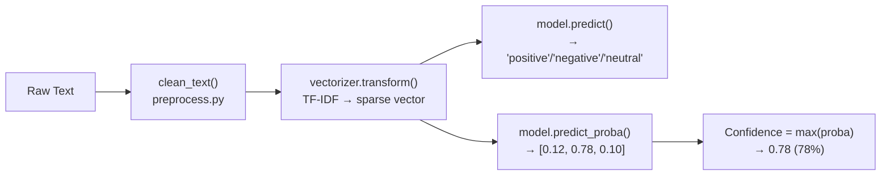
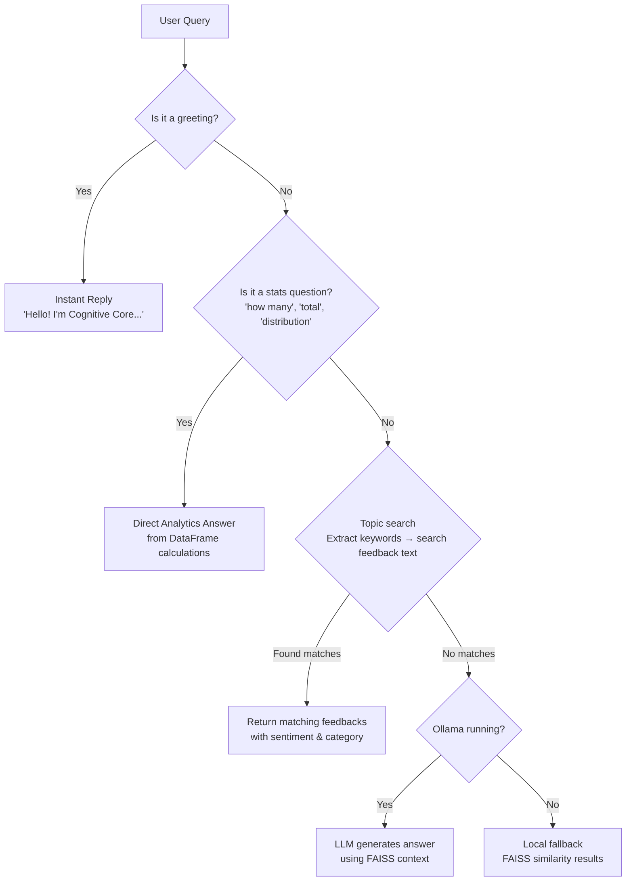
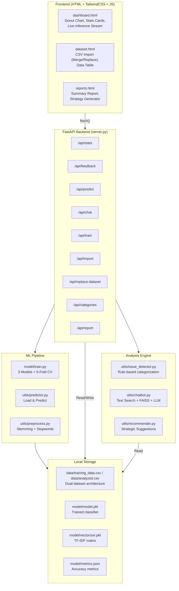
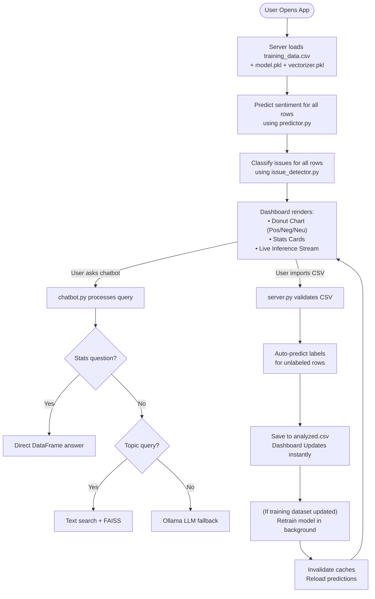

# Feedback Intelligence+ AI Chatbot — Complete Project Documentation

---

## 1. Project Title

**Feedback Intelligence+ with AI Chatbot**
*A Local-First Sentiment Analysis & Feedback Classification System with Smart AI Chatbot*

---

## 2. Project Description

Feedback Intelligence+ is a **fully offline, local-first web application** that automatically classifies customer feedback into **Positive**, **Negative**, or **Neutral** sentiments using machine learning. It also categorizes feedback into issue types (Technical, Performance, Pricing, UI/UX, General) and provides an AI chatbot for natural-language querying of the analyzed data.

The system accepts **unlabeled CSV feedback** from any domain (e-commerce, SaaS, food delivery, education, mobile apps), auto-predicts sentiment labels, classifies issues, and generates actionable business insights — all **without any external API keys or internet dependency**.

**Key Objectives:**
- Automate sentiment classification of raw customer feedback
- Identify critical issue categories that need attention
- Provide a conversational AI interface for data exploration
- Generate strategic improvement recommendations

---

## 3. Technology Stack

| Layer | Technology | Purpose |
|-------|-----------|---------|
| **Backend** | Python 3.14, FastAPI, Uvicorn | REST API server, routing, data processing |
| **ML Models** | Scikit-learn (LogisticRegression, MultinomialNB, LinearSVC) | Sentiment classification |
| **NLP** | NLTK (Porter Stemmer, Stopwords), TF-IDF Vectorizer | Text preprocessing & feature extraction |
| **Vector Search** | FAISS (Facebook AI Similarity Search) | Semantic feedback search in chatbot |
| **LLM (Optional)** | Ollama + Llama3 (local) | Open-ended chatbot queries |
| **Frontend** | HTML, TailwindCSS, Vanilla JS | Dashboard, Dataset Manager, Reports |
| **Data Storage** | CSV files (Pandas), Pickle (.pkl) | Feedback data & trained model persistence |

---

## 4. Project File Structure

```
Feedback Analyzer+ chatbot/
├── server.py                    # Main FastAPI backend (entry point)
├── requirements.txt             # Python dependencies
├── data/
│   └── feedback.csv             # Master training + analysis dataset (288 entries)
├── model/
│   ├── train.py                 # ML training pipeline (3 models + cross-validation)
│   ├── model.pkl                # Serialized best-performing model
│   ├── vectorizer.pkl           # Serialized TF-IDF vectorizer
│   └── metrics.json             # Training metrics for dashboard display
├── utils/
│   ├── preprocess.py            # Text cleaning (stemming, stopwords)
│   ├── predictor.py             # Prediction engine (loads model, predicts)
│   ├── issue_detector.py        # Rule-based issue categorization
│   ├── chatbot.py               # AI Chatbot (text search + FAISS + LLM)
│   └── recommender.py           # Strategic recommendation engine
└── frontend/
    ├── dashboard.html           # Main dashboard with donut chart + stats
    ├── dataset.html             # Dataset management + CSV import
    └── reports.html             # Summary reports + strategy generation
```

---

## 5. How Each Dashboard Metric is Calculated

### 5.1 Total Feedback
```
Source: server.py → /api/stats
Calculation: total = len(df)   # count of all rows in feedback.csv
```
Simply counts every feedback entry loaded from `data/feedback.csv`.

### 5.2 Model Accuracy
```
Source: model/metrics.json → "best_accuracy"
Calculated in: model/train.py → accuracy_score(y_test, best_pred)
```
**How it works:**
1. The dataset is split **80/20** (stratified) — 80% training, 20% test
2. Three models are trained: Logistic Regression, Naive Bayes, Linear SVM
3. Each is evaluated on the **held-out 20% test set** it has never seen
4. `accuracy_score = (correct predictions / total test samples) × 100`
5. The **best model by 5-fold cross-validation** is selected
6. Its test accuracy becomes the displayed "Model Accuracy"

> **Example:** 288 samples → 230 train, 58 test → If SVM correctly predicts 43/58 → Accuracy = 74.14%

### 5.3 Sentiment Score
```
Source: server.py → /api/stats
Calculation: score = positive_count / total_feedback
```
A ratio between 0.0 and 1.0 representing the proportion of positive feedback.
- **> 0.5** = More positive than negative → "POSITIVE BASELINE"
- **< 0.5** = More negative → "NEEDS IMPROVEMENT"

### 5.4 Critical Issues
```
Source: server.py → /api/stats
Calculation: critical = Technical_count + Pricing_count
```
Counts feedbacks categorized as either **Technical** (bugs, crashes, errors) or **Pricing** (billing, cost, subscriptions) by the rule-based issue detector in [issue_detector.py](file:///c:/Users/prajw/Feedback%20Analyzer+%20chatbot/utils/issue_detector.py). These two categories are considered "critical" because they directly impact user retention and revenue.

---

## 6. Complete Data Flow

### 6.1 Input → Processing → Output



| Stage | File | What Happens |
|-------|------|-------------|
| **Input** | `data/feedback.csv` or uploaded CSV | Raw text feedback (e.g., "Battery drain is insane") |
| **Preprocessing** | `utils/preprocess.py` | Lowercase → remove punctuation → remove stopwords → Porter stemming |
| **Feature Extraction** | `model/train.py` | TF-IDF vectorization (unigrams + bigrams, max 5000 features) |
| **Prediction** | `utils/predictor.py` | Load trained model.pkl → transform text → predict label + confidence |
| **Issue Detection** | `utils/issue_detector.py` | Keyword matching → assign category (Technical/Performance/Pricing/UI-UX/General) |
| **Storage** | `data/feedback.csv` | Append or replace dataset, save to disk |
| **Output** | `frontend/*.html` | Donut chart, category bars, live stream table, chatbot responses |

### 6.2 Text Preprocessing Pipeline Detail

```
Input:   "Battery drain is insane after the latest update!"
           ↓
Step 1:  "battery drain is insane after the latest update"     (lowercase)
           ↓
Step 2:  "battery drain is insane after the latest update"     (remove non-alpha → regex [^a-zA-Z])
           ↓
Step 3:  "battery drain insane latest update"                  (remove stopwords: is, after, the)
           ↓
Step 4:  "batteri drain insan latest updat"                    (Porter stemming)
           ↓
Output:  TF-IDF vector → [0.0, 0.31, 0.0, 0.42, ...]         (sparse feature vector)
```

---

## 7. Model Training Pipeline

> **File:** [model/train.py](file:///c:/Users/prajw/Feedback%20Analyzer+%20chatbot/model/train.py)

### 7.1 Training Steps



### 7.2 Three Models Compared

| Model | Algorithm | Key Hyperparameters | Strengths |
|-------|-----------|-------------------|-----------|
| **Logistic Regression** | Linear classifier with L2 regularization | `C=0.5`, `solver='lbfgs'` | Good baseline, interpretable, fast |
| **Multinomial Naive Bayes** | Probabilistic classifier using Bayes theorem | `alpha=1.0` (Laplace smoothing) | Excellent for text, handles small datasets |
| **Linear SVM** | Maximum-margin classifier with calibration | `C=0.5`, `CalibratedClassifierCV` | Best for high-dimensional sparse text features |

### 7.3 Model Selection Logic

1. Each model is cross-validated using **5-fold StratifiedKFold** (preserves class ratios)
2. The model with the **highest mean CV accuracy** is selected (not test accuracy — CV is more reliable)
3. An **overfitting check** compares CV accuracy vs test accuracy — gap > 5% triggers a warning
4. The winner is serialized to `model/model.pkl` with its vectorizer to `model/vectorizer.pkl`

### 7.4 TF-IDF Vectorizer Settings

| Parameter | Value | Why |
|-----------|-------|-----|
| `max_features` | 5000 | Limits vocabulary to top 5000 terms by importance |
| `ngram_range` | (1, 2) | Captures both single words ("crash") and bigrams ("battery drain") |
| `min_df` | 2 | Ignores words appearing in < 2 documents (reduces noise) |
| `max_df` | 0.95 | Ignores words appearing in > 95% of documents (too common) |
| `sublinear_tf` | True | Applies `1 + log(tf)` instead of raw frequency (reduces dominance of frequent terms) |

---

## 8. Prediction Engine

> **File:** [utils/predictor.py](file:///c:/Users/prajw/Feedback%20Analyzer+%20chatbot/utils/predictor.py)



**How confidence works:**
- `predict_proba()` returns probability for each class: `[P(positive), P(negative), P(neutral)]`
- Confidence = the **maximum probability** among all classes
- Example: `[0.12, 0.78, 0.10]` → predicted = `negative`, confidence = `0.78 (78%)`

---

## 9. Issue Detection

> **File:** [utils/issue_detector.py](file:///c:/Users/prajw/Feedback%20Analyzer+%20chatbot/utils/issue_detector.py)

This is a **rule-based keyword matcher** (not ML). It scans the feedback text for category-specific keywords:

| Category | Keywords (sample) | Example Feedback |
|----------|-----------|---------|
| **Technical** | bug, crash, error, broken, fix, fail, login, server | "App crashes every time I open settings" |
| **Performance** | slow, lag, speed, loading, freeze, battery, drain, memory | "Battery drain is insane after the update" |
| **Pricing** | price, expensive, billing, subscription, overpriced, fee, refund | "Too expensive for basic features" |
| **UI/UX** | ui, design, navigation, theme, dark mode, confusing, clunky | "Why did they remove the dark mode toggle" |
| **General** | *(fallback — no keywords matched)* | "Best purchase I've made this year" |

**Priority order:** Technical > Performance > Pricing > UI/UX > General (first match wins).

---

## 10. AI Chatbot Engine

> **File:** [utils/chatbot.py](file:///c:/Users/prajw/Feedback%20Analyzer+%20chatbot/utils/chatbot.py)

### 10.1 Three-Step Smart Pipeline



### 10.2 What the Chatbot Can Answer Locally (No LLM Needed)

| Query Type | Example | How It Answers |
|-----------|---------|---------------|
| **Total counts** | "How many feedbacks?" | `len(df)` → "288 total feedbacks" |
| **Sentiment counts** | "How many negative?" | `df['predicted'].value_counts()` |
| **Critical issues** | "How many critical?" | `Technical_count + Pricing_count` |
| **Distribution** | "Show sentiment split" | Calculates percentages from value_counts |
| **Topic search** | "Any feedback about battery drain?" | Text search in df['text'] + FAISS similarity |
| **Category deep-dive** | "Show pricing feedback" | Filters df where issue == 'Pricing' |
| **Keywords** | "Show trending words" | Counter on all feedback text |
| **Recommendations** | "What should we improve?" | Pulls negative feedback + suggestion engine |
| **Model stats** | "Model accuracy?" | Reads from metrics.json |

### 10.3 FAISS Vector Store

For queries that don't match direct text search, the chatbot uses **FAISS** (Facebook AI Similarity Search):

1. All feedback texts are TF-IDF vectorized → stored in FAISS IndexFlatL2
2. User query is vectorized with the same TF-IDF vectorizer
3. FAISS finds the **top-K nearest neighbors** by L2 distance
4. Results with distance < 1.5 are considered relevant

---

## 11. System Architecture



---

## 12. API Endpoints Reference

| Method | Endpoint | Purpose | Returns |
|--------|---------|---------|---------|
| `GET` | `/` | Dashboard page | HTML |
| `GET` | `/dataset` | Dataset management page | HTML |
| `GET` | `/reports` | Reports page | HTML |
| `GET` | `/api/stats` | All dashboard metrics | JSON: total, accuracy, sentiment, critical |
| `GET` | `/api/feedback` | All feedback with predictions | JSON array |
| `GET` | `/api/categories` | Issue category breakdown | JSON: category → count, percentage |
| `GET` | `/api/report` | Generated summary report | JSON: report text |
| `GET` | `/api/keywords` | Top keywords in feedback | JSON array |
| `POST` | `/api/predict` | Predict sentiment for one text | JSON: sentiment, confidence, issue |
| `POST` | `/api/chat` | Chatbot query | JSON: response text |
| `POST` | `/api/train` | Retrain model from current CSV | JSON: metrics |
| `POST` | `/api/import` | Upload CSV (merge) | JSON: status |
| `POST` | `/api/replace-dataset` | Upload CSV (replace all) | JSON: status |

---

## 13. End-to-End Flowchart



---

## 14. Database (Data Storage)

This project uses **no traditional database**. All data is stored locally in files using a **Dual-Dataset Architecture**:

| File | Format | Content | Size |
|------|--------|---------|------|
| `data/training_data.csv` | CSV | ~400 labeled feedback entries used strictly for training | ~18KB |
| `data/analyzed.csv` | CSV | User's live production data populated via Dashboard imports | Variable |
| `model/model.pkl` | Pickle | Serialized trained ML model | ~25KB |
| `model/vectorizer.pkl` | Pickle | Serialized TF-IDF vectorizer | ~12KB |
| `model/metrics.json` | JSON | Training accuracy, model name, counts | ~350B |

**Why no database?**
- The app is designed to be **portable and zero-dependency** — no PostgreSQL, MongoDB, or SQLite setup required
- CSV is human-readable and editable
- Pickle provides fast serialization for scikit-learn models
- The entire app can be copied to a USB drive and run anywhere

---

## 15. How to Run

```bash
# 1. Install dependencies
pip install -r requirements.txt

# 2. Start the server (auto-trains model on first run)
python server.py

# 3. Open in browser
# http://localhost:8000
```

**Optional (for advanced chatbot):**
```bash
# Install and run Ollama for LLM-powered chatbot
ollama run llama3
```

---

## 16. Training Data Distribution

The model is trained on **400+ diverse feedback entries** across 5 domains:

| Domain | Examples |
|--------|---------|
| **Software/SaaS** | "The AI features are game-changing", "Bugs everywhere" |
| **E-commerce** | "Delivery was super fast", "Received a used item sold as new" |
| **Food Delivery** | "Best pizza I ever had", "Food arrived cold after 90 mins" |
| **Education/Courses** | "Instructor explains complex topics simply", "Content is outdated" |
| **Mobile Apps** | "Face ID works flawlessly", "Battery drain is insane" |

| Label | Count | Percentage |
|-------|-------|-----------|
| Negative | 164 | 41.7% |
| Positive | 152 | 41.0% |
| Neutral | 80 | 17.4% |
